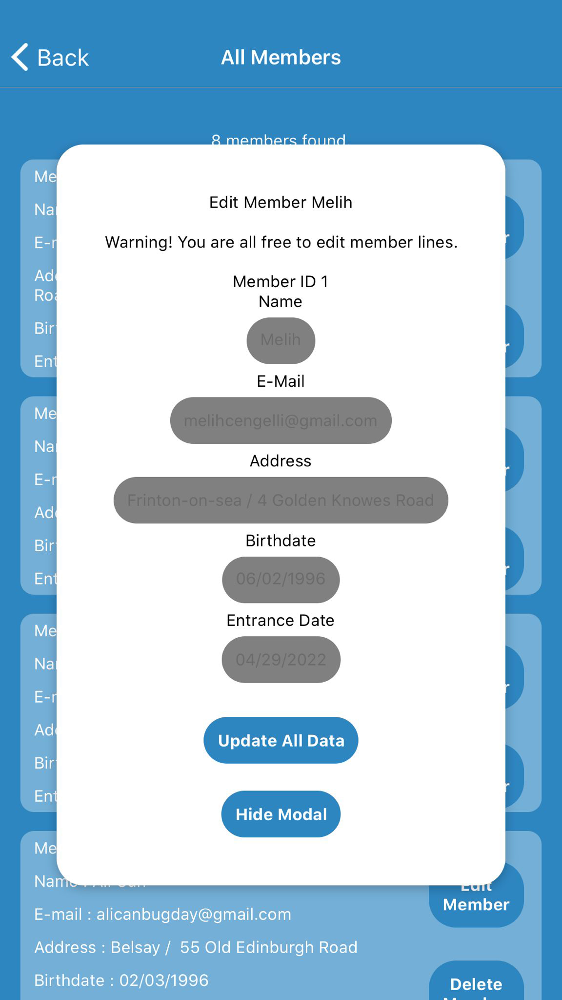
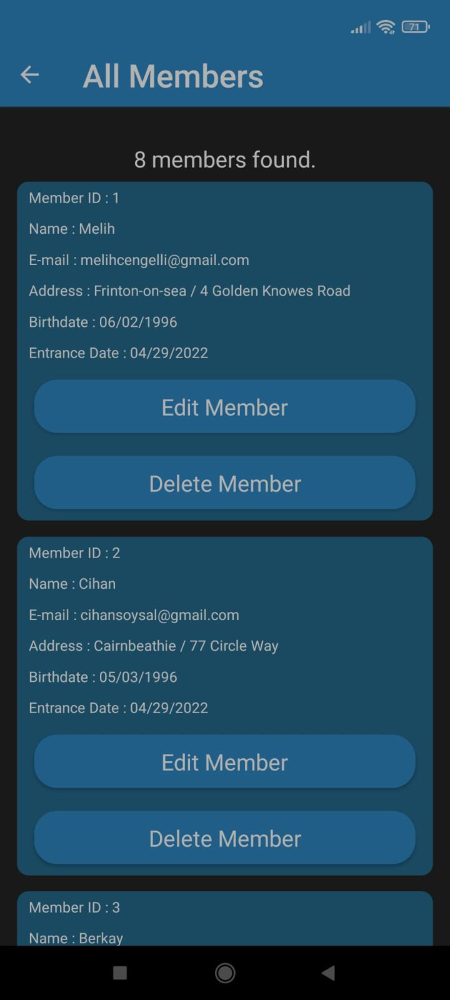
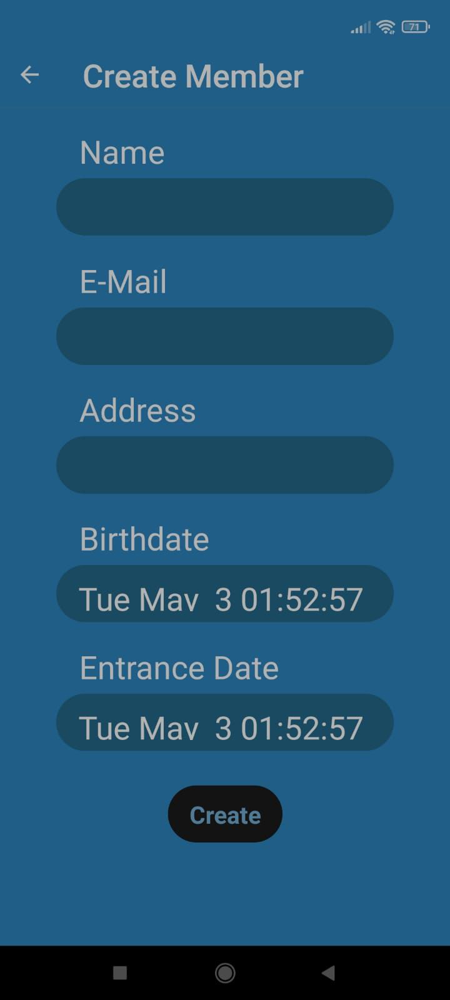

# ACTIMI-React-Native-Club-Members-Control-Application

<h3>IOS LOGIN PAGE</h3>

<h3>IOS HOME PAGE</h3>

<h3>IOS CREATE NEW MEMBER</h3>

<h3>IOS EDIT MEMBER</h3>

<h3>ANDROID LOGIN PAGE</h3>

<h3>ANDROID HOME PAGE</h3>

<h3>ANDROID MEMBERS</h3>

<h3>ANDROID CREATE NEW MEMBER</h3>

<h3>ANDROID EDIT MEMBER</h3>

